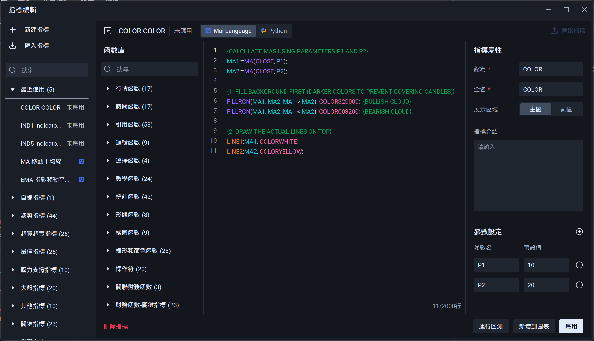
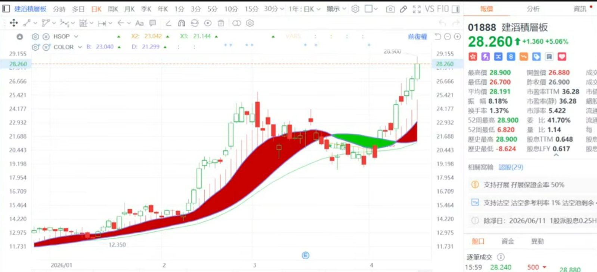
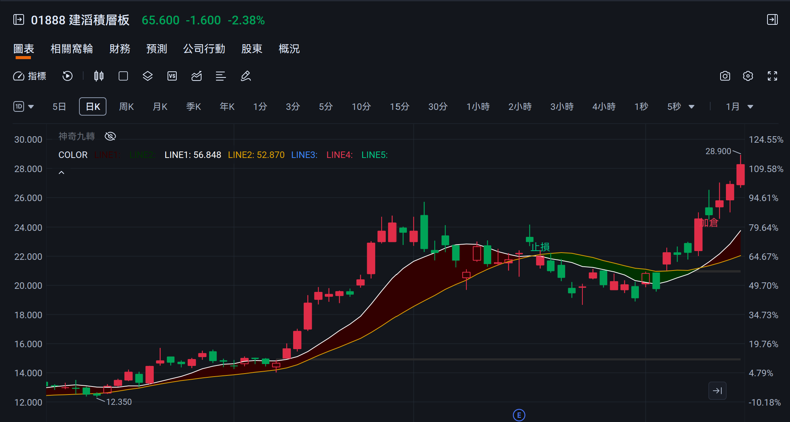

# FUTU Customized Indicators

Custom technical analysis indicators for FUTU Trading Platform (Mai Language).

**Credits:** This indicator is inspired by the "Bubble Dragon Investment" (bubbledragon_investment) charts on FUTU. Thank you for the inspiration!  
**Reference:** [FUTU Mai Language Documentation](https://www.futufin.com/cn/hant/support/topic1_541)

## Installation

1. Open FUTU Trading Platform
2. Select any stock → Chart → Indicators → Custom, Click 'Create a new custom indicator'
3. Click 'Mai Language', paste the script from `COLOR.ftindex`, then click 'Apply'
4. The indicator will appear in your custom indicators list

## Indicators

### COLOR.ftindex - Moving Average Cloud

A trend-following indicator that displays two moving averages with a colored cloud between them.

**Features:**
- Visual cloud representation of price trend strength
- Dark red cloud for bullish trend (MA1 > MA2)
- Dark green cloud for bearish trend (MA1 < MA2)
- White and yellow lines for MA1 and MA2 respectively

**Parameters:**
- `P1`: Period for first moving average
- `P2`: Period for second moving average

**Usage:**
Apply this indicator to any chart to identify trend direction and strength based on the cloud width and color.

## Screenshots

